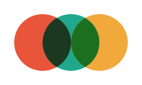

# Kulturo

**Mon journal culturel personnel**

*Regarder. Jouer. Lire. Garder une trace.*

---

Kulturo rassemble mes films, séries, jeux vidéo et livres dans un même espace. Ce que je découvre, ce qui m’a marqué, ce que j’aimerais retrouver : une mémoire personnelle qui se construit au fil des œuvres.

Une collection à parcourir par ses jaquettes, avec quelques repères essentiels : un statut, une note, un coup de cœur, une nouvelle lecture ou partie. Le tout dans une interface sombre, pensée aussi pour le mobile.

## Les espaces

| | |
| :--- | :--- |
| **Bibliothèque** | Retrouver ma collection, suivre mes médias en cours et garder mes envies dans la Wishlist. |
| **Sorties** | Découvrir ce qui arrive et retrouver les œuvres que j’attends déjà. |
| **Journal** | Revoir mon parcours au fil des mois, ou découvrir les ajouts de la Communauté. |
| **Moi** | Explorer mes habitudes, mes préférés et mes statistiques ; sauvegarder ma collection. |

## Version actuelle · 3.4.8

Une mise à jour consacrée à la fiabilité, à la continuité de navigation et aux finitions de l’interface.

- **Des chargements sûrs** : une réponse tardive ne peut plus remplacer la page ou le compte actuellement affiché.
- **Un contexte retrouvé après actualisation** : onglet, filtres, période, mois et position de lecture sont restaurés ensemble.
- **Des fiches autonomes** : rendu, enrichissement, métadonnées et transition de jaquette vivent dans un module dédié.
- **Des retours plus précis** : progression discrète, boutons occupés et notifications sans empilement inutile.
- **Une archive reproductible**, contrôlée par un script avant chaque publication.

[Historique des versions](CHANGELOG.md) · [Mise à jour et déploiement](DEPLOYMENT.md) · [Vérifications](tests/README.md)

Depuis la **3.4.6**, cette mise à jour ne demande aucun nouveau SQL. Pour une version plus ancienne, suivre les instructions de déploiement afin d’installer aussi la restauration complète des sauvegardes.

---

*Un projet personnel, qui évolue au fil de mes usages. Garder l’essentiel, lui donner une place, et prendre plaisir à le retrouver.*
